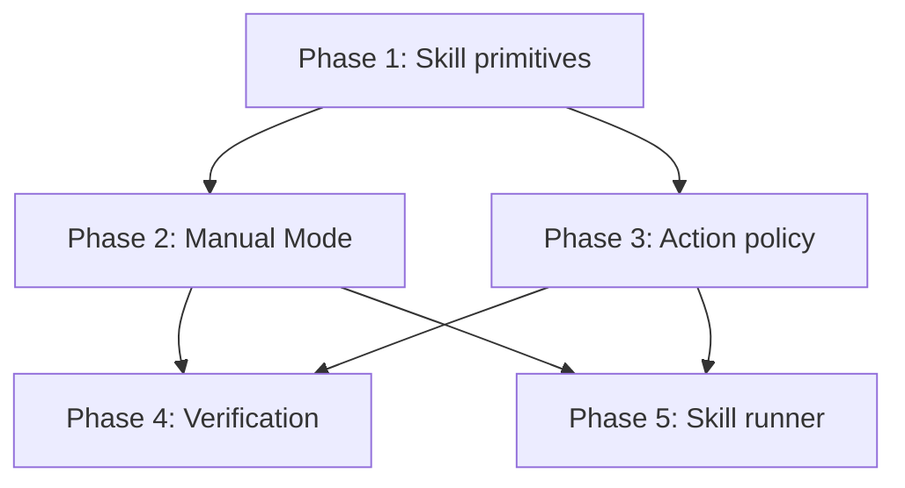
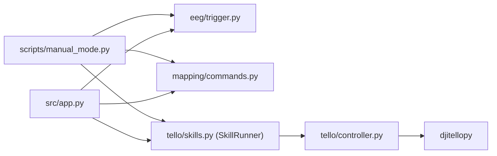

# Tello Basic Skills Plan

Implements the "Basic" skills from `docs/Prompts.md/tello_skills.md` and a keyboard `Manual_Mode` controller, building on the findings in `docs/Prompts.md/artifacts research.md`.

## Skills in scope

| Category | Skills |
|---|---|
| Movement | Forward, Back, Right, Left, Up, Down |
| State | Takeoff/Land toggle driven by `is_flying` |
| Rotation | Clockwise, Counter-clockwise |

## Design decisions

- `src/tello/controller.py` stays the only module that talks to `djitellopy`. `Tello/Mover.py` is a reference only.
- Every trigger goes through `SkillRunner.request(name)` (Phase 5). **Process** skills (takeoff, land) run to completion and reject all input meanwhile; **continuous** skills (movement, yaw) move while the action persists, then hover.
- `JAW_SHORT` toggles flight state: takeoff when grounded, land when flying. `JAW_LONG` and `JAW_EMERGENCY` both land normally (no motor stop).
- New scripts default to dry-run, require an explicit live flag, and always reach `controller.shutdown()` through `finally`.

## Phases

| Phase | File | Depends on |
|---|---|---|
| 1. Skill primitives | [phase_1_skill_primitives.md](phase_1_skill_primitives.md) | — |
| 2. Manual Mode | [phase_2_manual_mode.md](phase_2_manual_mode.md) | Phase 1 |
| 3. Action policy and EEG readiness | [phase_3_action_policy.md](phase_3_action_policy.md) | Phase 1 |
| 4. Calibration and integration verification | [phase_4_verification.md](phase_4_verification.md) | Phases 1–3 |
| 5. Skill runner: process and continuous skills | [phase_5_skill_runner.md](phase_5_skill_runner.md) | Phases 1–3 (replaces parts of 1 and 2) |

## Layering

Mapping code never imports the SDK; skills never import mapping code.

## Global safety requirements

- Battery at least 20% (enforced by `TelloController.connect`).
- Movement commands are ignored while grounded (`is_flying` guard) and while a process skill runs.
- Landing cancels any active movement.
- Open flight area, a spotter, and a hand on `E` / `Esc` for every live test.
- `is_flying` is local state, not telemetry; treat it as a guard only.
