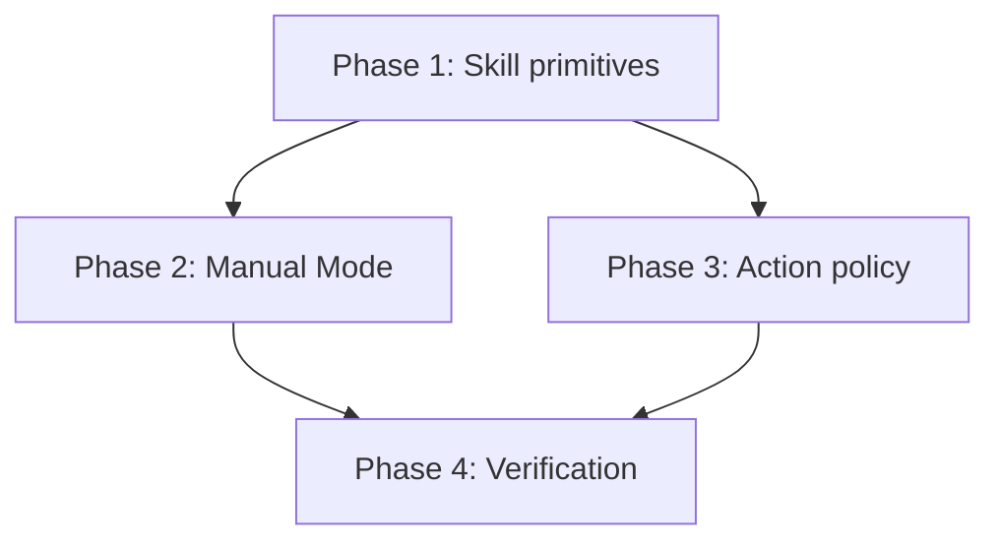
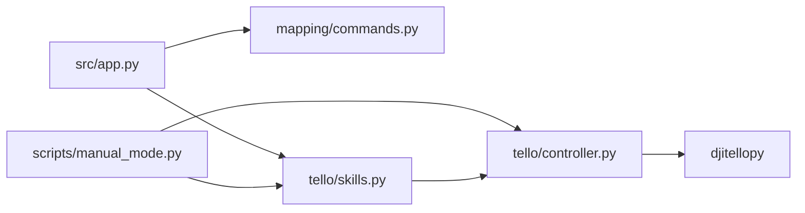

# Tello Basic Skills Plan

Implements the "Basic" skills from `docs/Prompts.md/tello_skills.md` and a keyboard `Manual_Mode` controller, building on the findings in `docs/Prompts.md/artifacts research.md`.

## Skills in scope

| Category | Skills |
|---|---|
| Movement | Forward, Back, Right, Left, Up, Down |
| State | Takeoff/Land toggle driven by `is_flying` |
| Rotation | Clockwise, Counter-clockwise |

## Design decisions

- `src/tello/controller.py` stays the only module that talks to `djitellopy`. `Tello/Mover.py` is a reference only.
- Named skills are **bounded RC bursts**: one RC tuple, a duration, then hover. Manual keyboard control stays **hold-to-move**.
- `JAW_SHORT` toggles flight state: takeoff when grounded, land when flying. `JAW_LONG` (land) and `JAW_EMERGENCY` (emergency land) keep their meaning.
- New scripts default to dry-run, require an explicit live flag, and always reach `controller.shutdown()` through `finally`.

## Phases

| Phase | File | Depends on |
|---|---|---|
| 1. Skill primitives | [phase_1_skill_primitives.md](phase_1_skill_primitives.md) | — |
| 2. Manual Mode | [phase_2_manual_mode.md](phase_2_manual_mode.md) | Phase 1 |
| 3. Action policy and EEG readiness | [phase_3_action_policy.md](phase_3_action_policy.md) | Phase 1 |
| 4. Calibration and integration verification | [phase_4_verification.md](phase_4_verification.md) | Phases 1–3 |

## Layering

Mapping code never imports the SDK; skills never import mapping code.

## Global safety requirements

- Battery at least 20% (enforced by `TelloController.connect`).
- Movement commands are ignored while grounded (`is_flying` guard).
- Landing and emergency landing cancel any active burst.
- Open flight area, a spotter, and a hand on `E` / `Esc` for every live test.
- `is_flying` is local state, not telemetry; treat it as a guard only.
